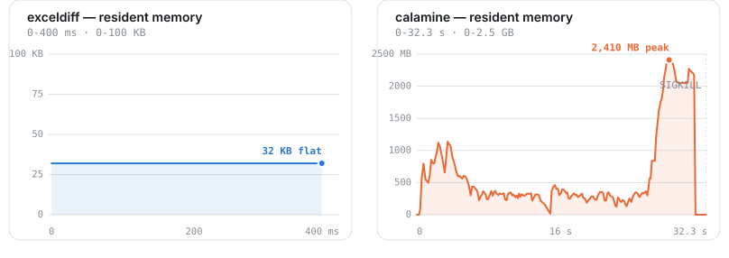
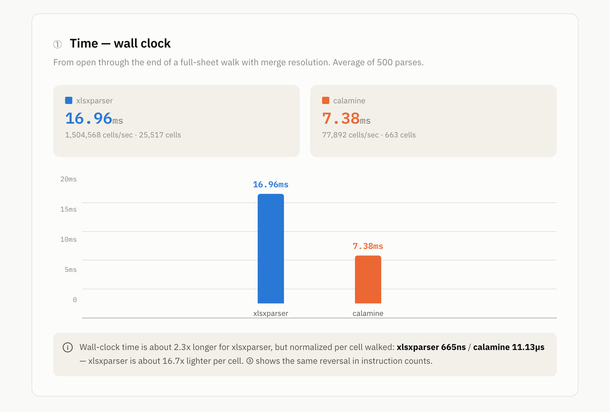

# exceldiff

*[English](README.en.md)*

[](https://github.com/MinamiyamaKotaro/exceldiff/actions/workflows/rust-ci.yml)
[](https://github.com/MinamiyamaKotaro/exceldiff/actions/workflows/docs.yml)
[](https://crates.io/crates/exceldiff)
[](https://codecov.io/gh/MinamiyamaKotaro/exceldiff)
[](LICENSE)

Rustで書かれた、軽量・高速な `.xlsx`(OOXML)パーサーライブラリです。

## 開発動機

`exceldiff` は、日本のビジネスシステムでよく見られるような、行・列数が極端に多い(「方眼紙Excel」)シートや結合セルを多用したファイルを主な対象に、高速・低メモリで動作する `.xlsx` パーサーを目指しています。フルのインメモリ2次元グリッドを構築せずにこの種のファイルをパース・解析し、フロントエンドや他システムから扱いやすいJSONとして結果を出力することがゴールです。

## ステータス

コア実装は完了しています——以下に示す設計上の全モジュールが実装済みで、`docs/design/` の設計書どおりにテストされています。公開API(`parse_workbook`、`parse_workbook_reader`、`to_json_string`、`to_json_writer`、`resolve_color`)は `src/lib.rs` に結線されています。

```rust
let workbook = exceldiff::parse_workbook("book.xlsx")?;
let json = exceldiff::to_json_string(&workbook)?;
```

- [docs/requirement/requirements.md](docs/requirement/requirements.md) —
  機能要件と、後述する5フェーズ・パイプラインの要約([English](docs/requirement/requirements.en.md)版もあります)。
- [docs/design/architecture.md](docs/design/architecture.md) — `src/`
  ディレクトリ全体の構成・各モジュールの責務・設計方針([English](docs/design/architecture.en.md)版もあります)。
  ここから、全ファイルそれぞれの設計書(責務・スコープ、主要な型・関数シグネチャ、依存関係、エラー処理方針、テスト方針、未決事項を記載)にリンクしており、各設計書は日英両方(`*.md` / `*.en.md`)で書かれています。実装が設計書のドラフトと異なる形に落ち着いた場合(外部APIの詳細が想定と違う形で確定した、テスト作成中にバグが見つかった等)は、何がどう変わったかを記録するため設計書自体をその場で更新しています。

## 入出力

**入力**: `.xlsx` ファイルを、2つのエントリポイントのいずれかで受け取ります——

- `parse_workbook(path)` — 一般的なケース。ファイルシステムのパスから読み込みます。
- `parse_workbook_reader(reader)` — `Read + Seek` を実装する任意の入力(インメモリバッファ、読み切ったHTTPレスポンスボディなど)から読み込みます。ファイルシステムを経由しない呼び出し元向けです。

いずれも `Result<Workbook, Error>` を返します。これは全シート(可視・非表示・完全非表示のいずれも含む)を完全に解決したインメモリ表現です。それぞれに `_with_limits` 版があり、既定値(ZIPエントリごとに512MiBのZip Bomb上限、累計2GiB、シートあたり500万セル上限——`Error::TooManyCells`)を明示的な `SizeLimits` で上書きできます。セル数上限は、生のXMLバイトサイズとは独立にシートのメモリ使用量を制限します——病的にセル密度の高いファイルは、バイトサイズ上限を余裕で下回りつつも、`<c>` 要素が一つずつ実体化されるにつれ数GBのコストがかかることがあるためです。

**出力**: `to_json_string(&workbook)` / `to_json_writer(&workbook, writer)` は、解決済みの `Workbook` を以下のような形のJSONへシリアライズします(実際の出力例。単一の結合範囲 `A1:C3` に1つのテキストセルを持つシートである `tests/fixtures/complex/houganshi_merged.xlsx` から取得):

```json
{
  "sheets": [
    {
      "name": "Sheet1",
      "visibility": "visible",
      "maxRow": 3,
      "maxCol": 3,
      "defaultColumnWidth": null,
      "columns": [],
      "cells": [
        {
          "row": 1,
          "col": 1,
          "value": { "type": "text", "value": "houganshi" },
          "rowSpan": 3,
          "colSpan": 3
        }
      ],
      "images": []
    }
  ]
}
```

- `visibility` は `<sheet state="...">` に対応し `"visible"` / `"hidden"` / `"veryHidden"` のいずれかです。
- `maxRow`/`maxCol` はシートのバウンディングボックス(値が入っているか結合されている最大座標)です——OOXMLの `<dimension>` の値ではなく、そちらは一切読みません。
- `columns` はシートの `<cols>` 範囲(`{"min", "max", "width"}`、1始まり・両端含む)で、各エントリはその範囲内の全列をカバーします——全セルに `columnWidth` の値を複製するのではありません。複製すると出力サイズが無駄に肥大化するためです(後述の[疎な結合セル配置](#疎な結合セル配置)で結合セルにも同じ原則を適用しています)。`defaultColumnWidth` は `<sheetFormatPr defaultColWidth="..">` の値、未設定なら `null` です。`columns` のどの範囲にも含まれない列はこれにフォールバックします。この2つの例で使ったフィクスチャはどちらも `<cols>` を宣言していないため、空/不在のケースを示しています。
- `cells` には値が入っている座標のみが含まれます。空白セルは単に存在しないだけで、`null`/`"empty"` エントリとして出力されることはありません([開発動機](#開発動機)参照)。セルは行優先・列優先(読み順どおり)で並びます。ソースXML内での出現順に関わらず、シートは `(row, col)` をキーとする `BTreeMap` で保持されているためです。
- 各セルの `value` は `type` でタグ付けされます:
  `"number"` | `"text"` | `"boolean"` | `"error"` | `"dateTime"` |
  `"empty"`(書式のみのセル、またはJSONで表現できない値——`NaN`/`±Infinity`)。
  `"dateTime"` はタイムゾーン指定子・小数秒なしのISO 8601形式でシリアライズされます(例: `"2023-06-15T00:00:00"`。日付のみのセルも時刻部分が深夜0時になります。Excel自体が日付のみと日付+時刻を型として区別しないためです)。
- `rowSpan`/`colSpan` は結合範囲の起点セルにのみ存在し(値は `> 1`)、範囲内の他の座標は全てこの同じ起点セルに解決され、別のJSONセルとしては出力されません。
- `style` はセルが解決済みのスタイルを何かしら持つ場合のみ存在します(それ以外は完全に省略され、`"style": {}` として出力されることはありません):
  - `font`: `{"sizePt": 11.0, "bold": false}`。
  - `wrapText`: 真偽値。
  - `alignment`: 水平方向の配置を表す文字列——`"general"` |
    `"left"` | `"center"` | `"right"` | `"fill"` | `"justify"` |
    `"centerContinuous"` | `"distributed"`。常に存在します(後述の `numberFormat` と異なり、`"general"` 自体が意味のある値であり「報告すべき情報なし」ではないため)。
  - `numberFormat`: 解決済みの書式コードを文字列で表したもの(例: `"0%"`、`"yyyy-mm-dd"`)。組み込みnumFmtIdテーブル(ECMA-376 §18.8.30)とカスタム `<numFmt>` コードの両方をカバーします。書式が `"General"` の場合は省略されます(報告すべき特別な書式なし)。
  - `fillFgColor`/`fillBgColor`: セルの塗りつぶし色。`<fgColor>`/`<bgColor>` が指定するそのままの形で `type` タグ付けされます——`{"type": "rgb",
    "value": "FFFF0000"}` | `{"type": "theme", "value": {"index": 4,
    "tint": -0.25}}` | `{"type": "indexed", "value": 64}`。最終的な表示RGB値に変換せず、この生の未解決形式のまま保持しています。exceldiffの出力は差分検出が主目的であり、塗りつぶし色が*変わったこと*を知るのに実際どんな色に見えるかを知る必要はないためです。塗りつぶしに前景/背景色が全く無い場合は省略されます。実際の表示色が必要な場合は、`resolve_color` がこの3形式のいずれもオンデマンドで実RGB値に変換します——後述の[表示色の解決](#表示色の解決)参照。
  - `borders`: `{"top": bool, "right": bool, "bottom": bool, "left": bool}`
    ——各辺に罫線があるかどうか(線のスタイル/太さ/色は報告されません。`<diagonal>` も追跡しません)。どの辺にも罫線が無い場合は完全に省略されます。`fillFgColor`/`fillBgColor` と同じ「報告すべき情報なし」の扱いで、全て`false`として出力されることはありません。
- `hyperlink` はセルがハイパーリンクを持つ場合のみ存在します(それ以外は省略され、`"hyperlink": {}` として出力されることはありません): `{"target": "...",
  "location": "...", "tooltip": "..."}`、各フィールドは無い場合それぞれ省略されます。`target` は解決済みの外部URLまたは内部パーツパス(ワークシート自身のリレーションシップから)です。`location` はワークブック内ジャンプ(例: `"Sheet2!A1"`)で、内部ハイパーリンクで `target` の代わりに、またはそれと一緒に存在します。`fillFgColor`/`fillBgColor` と同様に生のまま保持しています——target/location文字列は存在確認もフェッチも一切行わないため、削除済みシートや無効なURLを指すハイパーリンクもそのまま無変換で往復します(追跡ではなく差分検出が目的です)。複数セルにまたがる `ref`(`<hyperlink ref="A1:B1">`)は、その範囲内で既に値かスタイルを持つ各セルへ独立に紐付きます。値・スタイル・ハイパーリンクのいずれも持たないセルは、そのような範囲内であっても実体化されません。
- `images` はシートのセル固定の埋め込み画像です(`style` と異なり、無い場合も空配列として常に存在します)。形については後述の[埋め込み画像](#埋め込み画像)参照。

2つ目の実例——1行に全ての `CellValue` バリアントを持つケース(`tests/fixtures/normal/basic_types.xlsx`。可読性のため列順に並べ替えていますが、実際の順序は不定です):

```json
{
  "sheets": [
    {
      "name": "Sheet1",
      "visibility": "visible",
      "maxRow": 1,
      "maxCol": 7,
      "defaultColumnWidth": null,
      "columns": [],
      "cells": [
        { "row": 1, "col": 1, "value": { "type": "text", "value": "日本語Text" } },
        { "row": 1, "col": 2, "value": { "type": "number", "value": 42.0 } },
        { "row": 1, "col": 3, "value": { "type": "number", "value": 19.99 } },
        {
          "row": 1, "col": 4,
          "value": { "type": "dateTime", "value": "2023-06-15T00:00:00" },
          "style": {
            "font": { "sizePt": 11.0, "bold": false },
            "wrapText": false,
            "alignment": "general",
            "numberFormat": "yyyy-mm-dd"
          }
        },
        { "row": 1, "col": 5, "value": { "type": "boolean", "value": true } },
        { "row": 1, "col": 6, "value": { "type": "boolean", "value": false } },
        { "row": 1, "col": 7, "value": { "type": "error", "value": "#N/A" } }
      ],
      "images": []
    }
  ]
}
```

(列4は日付セルです——`numberFormat` はセルの `<xf numFmtId="...">` から、`xl/styles.xml` の組み込み/カスタム `<numFmt>` テーブルに対して解決されます。`openpyxl` の既定日付書式は `"yyyy-mm-dd"` です。)

3つ目の実例——`<cols>` を宣言しているシート(`tests/fixtures/normal.rs` の `column_widths()`: `<col min="1" max="3"
width="12.5"/>`、`<col min="5" max="5" width="30"/>`、`<sheetFormatPr defaultColWidth="9.1"/>`):

```json
{
  "maxRow": 1,
  "maxCol": 5,
  "defaultColumnWidth": 9.1,
  "columns": [
    { "min": 1, "max": 3, "width": 12.5 },
    { "min": 5, "max": 5, "width": 30.0 }
  ],
  "cells": [
    { "row": 1, "col": 1, "value": { "type": "number", "value": 1.0 } },
    { "row": 1, "col": 5, "value": { "type": "number", "value": 2.0 } }
  ]
}
```

列4は2つの `columns` 範囲の間の隙間にあるため、そこにセルがあれば(この例には存在しません)どちらの範囲の `width` でもなく `defaultColumnWidth`(9.1)にフォールバックします。

## 埋め込み画像

`images` はシート単位の、セルに固定された埋め込み画像(`xl/drawings/drawingN.xml`)の配列です——実際の出力例(`tests/fixtures/complex/embedded_image.xlsx` から。`B2:E9` に固定されハイパーリンクを持つ画像が1つ。以下では簡潔さのため `cells`/`columns` を省略しています):

```json
{
  "images": [
    {
      "anchor": {
        "type": "twoCell",
        "from": { "row": 2, "col": 2, "colOff": 10000, "rowOff": 20000 },
        "to": { "row": 9, "col": 5, "colOff": 0, "rowOff": 0 }
      },
      "target": "xl/media/image1.png",
      "hyperlink": "https://example.com/sample-image"
    }
  ]
}
```

- `anchor` は `type` でタグ付けされます: `"twoCell"`(2つのセル角の間に伸びる、`from`/`to`)または `"oneCell"`(`from` に加えEMU単位のサイズ `ext: {"cx", "cy"}`——`oneCell` アンカーはどのセル境界にもサイズが依存しないため `to` マーカーを持ちません)。`row`/`col` は1始まりで、本crateが出力する他の全セル座標と同じです。`colOff`/`rowOff` はそのセル*内*でのEMU単位オフセットです(丸めて捨てずに保持することで、数ピクセルずれた画像と全く動いていない画像を差分で区別できます)。
- `target` は埋め込みメディアパーツの解決済みパス(例: `"xl/media/image1.png"`)です——画像自体のバイト列は完全にスコープ外です(差分検出ツールにピクセルデータは不要であり、読み込むとメモリ使用量がセル数ではなく画像数にスケールしてしまいます)。
- `hyperlink` は画像自身のハイパーリンク(`a:hlinkClick`)で、セルのハイパーリンク(`JsonCell` レベルのフィールド。前述)とは別物です。画像がハイパーリンクを持たない場合は省略されます。`Internal`(パッケージ内)ターゲットは `target` と同じ方法でZIPエントリ名相当のパスへ解決され、`External`(上記のようなURL)はそのまま保持されます。
- グループ化された画像(`<xdr:grpSp>`)は、内包する各 `<xdr:pic>` のアンカーを所属グループ相対で解決した上で、同じシート単位の `images` 配列に平坦化されます——別途グループ構造が公開されることはありません。

## 表示色の解決

上記の `fillFgColor`/`fillBgColor` は、exceldiffの主目的が描画ではなく差分検出であるため生のまま保持されています——しかし、呼び出し側がセルの実際の表示色を(変化したかどうかだけでなく)知る必要がある場合、`resolve_color` が3つの `ColorRef` 形式(`rgb` / `theme`+`tint` / `indexed`)のいずれもオンデマンドで実際の `Rgb { r, g, b }` 値に変換します:

```rust
use exceldiff::{parse_workbook, resolve_color, CellRef};

let workbook = parse_workbook("book.xlsx")?;
let sheet = &workbook.sheets()[0];
let cell = sheet.get(CellRef { row: 1, col: 1 }).unwrap();

if let Some(color_ref) = cell.style.as_ref().and_then(|s| s.fill_fg_color.as_ref()) {
    let rgb = resolve_color(color_ref, workbook.theme());
    // 例: Some(Rgb { r: 0x4F, g: 0x81, b: 0xBD })
}
```

- `theme`+`tint` 参照は、ワークブックの `xl/theme/theme{N}.xml` の `<clrScheme>`(`Workbook::theme()`)に対して解決され、ECMA-376のtint輝度補正を適用します。ワークブックにテーマパーツが全く無い場合や、参照先のスロットインデックスが範囲外の場合は `None` を返します。
- `indexed` 参照はレガシーなECMA-376の64色パレットに対して解決されます。`indexed=64`/`65`(「システム前景色」/「システム背景色」の特殊値)は、OSのシステムパレットに依存せず固定の `#000000`/`#FFFFFF` に解決されます(本crateはヘッドレスで動作するため)。
- `resolve_color` は不正な入力(範囲外のテーマインデックス、非有限な `tint`、不正な16進数)に対してパニックせず、代わりに `None` を返します。
- `xl/theme/theme{N}.xml` は、ワークブックのスタイルシートが実際にテーマ色を参照している場合のみ読み込み・パースされます(「使う分だけ払う」)——一度もテーマ色を使わないワークブックは、ファイル内にパーツが存在していてもこの機能のI/O・CPUコストを一切払いません。

## アーキテクチャ

1. **リレーションシップ解決** — `_rels` パーツをパースし、シートの `r:id` からワークシートファイルパスへのルーティングマップを構築した上で、中間データを即座に破棄します。
2. **サニタイズ** — 信頼できないコンテンツをパースする前に、zip bomb・zip-slipパストラバーサル・XXEから防御します。
3. **ストリームパース** — SAXスタイルのリーダーが `<sheetData>` を `<row>` 単位で処理し、シート全体のXML DOMをメモリ上に保持しません。
4. **解決** — 共有文字列(`t="s"`)とセルスタイルはSST/スタイルシートに対して解決され、`<mergeCells>` 範囲はストリームパス完了後に収集済みセルに対して解決されます。
5. **JSON出力** — 解決済みのデータモデルは(結合セル用の `row_span`/`col_span` を含む)構造化JSONへシリアライズされます。これは主要な `Workbook` を返すAPIとは別の独立したステップです。

設計を駆動する中核要件:

- **疎なストレージ** — セルは密な2次元配列ではなく座標キー付きマップに保持されるため、疎な「方眼紙」シートもメモリ上で低コストに保持できます。
- **結合セルの透過性** — 結合範囲内の任意の座標は(バウンディングボックスによるO(1)事前チェックとシートの結合範囲群に対する幾何的包含スキャンにより)、その範囲の起点セルと同じ値・結合メタデータに解決されます。
- **I/Oとドメインロジックの分離を維持** — XML/ZIP処理(`container/`、`parse/`)は解決ロジック(`resolve/`)と決して混在しません。解決ロジックはインメモリデータのみで純粋に動作し、単体テストにI/Oを必要としません。

モジュール構成(各ファイルの責務の完全な内訳は [docs/design/architecture.md](docs/design/architecture.md) 参照):

```text
src/
  lib.rs        # 公開APIのエントリポイント (parse_workbook, parse_workbook_reader, to_json_string, ...)
  error.rs      # クレート全体の共通エラー型
  pipeline.rs   # 5フェーズ・パイプラインとリソースの生存期間のオーケストレーション

  container/    # ZIP (OPC) 展開、zip-bomb/zip-slip防御
  parse/        # XMLパース (quick-xml の使用はここに閉じ込める)、XXE対策
  model/        # 純粋なデータ構造 (Workbook, Sheet, Cell, CellValue, ...)
  resolve/      # 共有文字列/スタイル/結合セルの解決 + オンデマンドの色解決、I/O非依存

  json.rs       # 解決済み Workbook を JSON へシリアライズ
```

## 対応OOXMLパーツ

- `xl/_rels/workbook.xml.rels`
- `xl/workbook.xml`(`<workbookPr date1904="...">` を含む。日付/時刻セルのシリアル値を1900年方式/1904年方式のどちらで解決するか判定するのに必要)
- `xl/sharedStrings.xml`(リッチテキストランの連結、`xml:space="preserve"` の処理、CDATAラン、Excelがリテラルな改行に使う `_x000D_` エスケープ)
- `xl/styles.xml`(フォントサイズ/太字、水平方向配置、折り返し、書式コード——組み込みnumFmtIdテーブル(ECMA-376 §18.8.30)とカスタム `<numFmt>` コード両方——塗りつぶし色(生の `rgb`/`theme`+`tint`/`indexed` 形式のまま保持。実RGB値への変換は前述の[表示色の解決](#表示色の解決)参照)、辺ごとの罫線有無——線のスタイル/太さ/色や `<diagonal>` は読みません)
- `xl/theme/theme{N}.xml`(`<clrScheme>` の12色。スタイルが実際にテーマ色を参照している場合のみ読み込みます。前述の[表示色の解決](#表示色の解決)参照)
- `xl/worksheets/sheetX.xml`(`<sheetData>`——他の全ての日付/時刻セルが使う数値シリアル日付と並んで、`t="d"` のISO 8601日付セルも同じ `"dateTime"` 出力に統一されます——`<mergeCells>`、および生のまま未解決で保持する `<hyperlinks>`(前述の `hyperlink` フィールド参照))
- `xl/worksheets/_rels/sheetX.xml.rels`(`<hyperlink r:id="...">` を生のTarget文字列に解決します——シートが `r:id` 付きのハイパーリンクを少なくとも1つ宣言している場合のみ読み込みます。`location` のみの内部ハイパーリンクではこの読み込みは発生しません)
- `xl/drawings/drawingN.xml` とその `_rels`(セルに固定された埋め込み画像——アンカー形状、埋め込みメディアの解決済みパス、画像自身のハイパーリンク。`<xdr:grpSp>` グループにネストした画像を含む。後述の[埋め込み画像](#埋め込み画像)参照)

`[Content_Types].xml` は一切読みません——ワークブックパーツの実際のパスは、慣習的な `xl/workbook.xml` と仮定するのではなく `_rels/.rels` の `officeDocument` リレーションシップ経由で解決します(Issue #55)が、この解決はパーツの宣言されたContent-Typeを `[Content_Types].xml` と突き合わせて検証することは一切ありません(この判断の理由と厳密なOPC準拠とのトレードオフについては [pipeline.md 未決事項3](docs/design/pipeline.md) 参照)。

## ベンチマーク

ベンチマークは [`hyperfine`](https://github.com/sharkdp/hyperfine) を用い、`macOS 26.6.1` 上の `Apple M2 Pro` で `--warmup 3` オプションで実施しました。`exceldiff`(`parse_workbook` 経由)と、広く使われている純Rust製 `.xlsx` リーダーである [`calamine`](https://github.com/tafia/calamine) `0.26.1`(`worksheet_range` 経由)をどちらもreleaseビルドで比較しています。対象は `tests/fixtures/complex/extreme_sparse.xlsx`——実際にopenpyxlで作成した、`A1` と `XFD1048576`(Excelの実際の最大値: 行1,048,576、列16,384)の2セルにしか値が入っていないファイルです。これは本ライブラリが対象とする、疎な「方眼紙Excel」の形そのものです([開発動機](#開発動機)参照)。

```bash
exceldiff
  Time (mean ± σ):       3.0 ms ±   1.0 ms    [User: 1.3 ms, System: 1.1 ms]
  Range (min … max):     2.1 ms …  18.3 ms    410 runs
```

`calamine` は完走したhyperfineの実行として示されていません。なぜなら一度も完走しなかったからです: 繰り返し実行するたびに、常駐メモリが数GBまで膨れ上がった末、約23〜24秒後にOSにより過剰メモリ使用でkillされました。原因は偶然ではなく構造的なものです: `calamine` の `Range<T>`(`worksheet_range` が返す型)は常に、値が入っているセルの*バウンディングボックス*サイズに合わせた単一の密な `Vec<T>` を裏側に持ちます——`Range::from_sparse`(`calamine` `0.26.1` の `src/lib.rs`)はこのバウンディングボックスから `cols * rows` を計算し、実際に値が入っているセルがどれだけ少なくても `vec![T::default();
cols * rows]` を確保します。今回は値の入った2つの角がシート全体に及んでいるため、そのバウンディングボックスは 1,048,576 x 16,384 = 17,179,869,184 要素そのものであり、この確保の試みがプロセスをkillさせる原因です。

`exceldiff` がこの問題に陥らないのは、セルが座標キー付きの `BTreeMap<CellRef, Cell>`(前述の[アーキテクチャ](#アーキテクチャ)参照)に、シートのアドレス可能なバウンディングボックスではなく実際に値が入っているセル数に応じたサイズで保持されているためです——そのため `extreme_sparse.xlsx` は `exceldiff` にとって正確に2つのマップエントリのコストしかかかりません。

同じ実行を可視化したもの: 各プロセスの起動から終了までの常駐メモリ(`ps -o rss` を100ms間隔でサンプリング)——



`exceldiff` の線が32KBでフラットなのは、上記の2マップエントリ以外に確保するものが何も無いためです。`calamine` の線は(`Vec` が拡張のたびに再確保するためノイズを伴いながら)上昇し続け、32.2秒でOSが `SIGKILL` を送るまでに常駐メモリのピークは2.35GBに達しました(実行開始時点の空きメモリは約58MB、総メモリ16GBのマシン)。100ms粒度でシェルループから `ps` をポーリングして採取したものでありプロファイラではないため、サンプル間の短いスパイクは捕捉できておらず、実際のピークは示した値よりわずかに高い可能性があります。

### 疎な結合セル配置

既存の全ての上限を守っていても、結合セルの多いファイルは無関係な別のコストにぶつかることがあります([Issue #43](https://github.com/MinamiyamaKotaro/xlsxparser/issues/43)): シートの対角にある2つの1x1結合を配置するだけで、結合セルのバウンディングボックスがシートのほぼ全体を覆うように広がり、それ以外の全セルが起点解決の際に結合範囲全体への線形スキャンにフォールバックしてしまう——正当なファイルがJSON生成時にO(セル数 × 結合範囲数)のコストになってしまう問題です。`Sheet::finalize_merges` は、結合が空間上どう配置されていても影響を受けない単一のスイープラインパスでこれを解決します(詳細な経緯は [docs/design/model/sheet.md](docs/design/model/sheet.md) の「修正: `finalize_merges`」節参照)。

上記と同じ方法(`hyperfine`、`--warmup 1`、同一マシン)で、300,000個の値入りセルと20,000件の結合(`resolve::merge::MAX_MERGE_REGIONS`、現在の上限)をバウンディングボックスが最大化するよう配置して生成した838KBのファイル(`tests/fixtures/security.rs` の `sparse_merge_bounding_box_amplification`)で計測:

```bash
before (pre-#43 fix, v0.10.0)
  Time (mean ± σ):     14.918 s ±  0.242 s    3 runs

after (this fix, v0.10.1)
  Time (mean ± σ):     600.6 ms ±   7.9 ms    4 runs
```

### 実際の結合セルの多いワークシート vs. calamine

> **注: 目的が異なれば結果も異なります**
>
> `calamine` は生データ抽出に特化しており、スタイルのみを持つ空白セルは無視します。対照的に `exceldiff` は見た目と差分の完全な再現を目指しているため、背景の塗りつぶしや罫線しか持たない空白セルも全て保持します。以下の実ファイルベンチマークでは、2つのライブラリが本質的に異なる量の情報(解像度)を抽出していることに注意してください。

上記2つのベンチマークは合成的なストレステストです。こちらは実際に手作業で作成されたファイルです: `tests/fixtures/other/standard_skill_sheet.xlsx`——`A1:D11`、`H3:Q3`、`J36:J39` など不規則に配置された155個の結合セルを持つスキルマトリクス形式のスプレッドシートで、ストレステスト生成器ではなく実際の業務テンプレートに現れるようなレイアウトです。

`exceldiff`(`parse_workbook` + `iter_cells`)と `calamine` `0.36.1`(`worksheet_range` + `merge_cells_by_sheet_name`。同じ方法で走査・結合解決)を比較し、releaseビルドで500回のパースを平均した結果です(`poc/skillsheet-bench-poc/` という使い捨ての比較用crateで計測——`calamine` は公開パッケージの依存関係には追加されておらず、今後も追加されません):

| | `exceldiff` | `calamine` |
|---|---|---|
| パースあたりの実行時間 | 16.96 ms | 7.38 ms |
| パースあたりの命令数 | 200,474,727 | 84,912,087 |
| ピークメモリ使用量 | 6.73 MB | 2.38 MB |
| 走査したセル数 | 25,517 | 663 |
| **走査セルあたりの時間** | **665 ns** | 11.13 µs |
| **走査セルあたりの命令数** | **7,858** | 128,073 |
| ブロックI/O(read+write操作、500回分) | 0 | 0 |


単純な実時間の比較として読むと、`exceldiff` が2.3倍遅く見えます。しかしこれは同じ量の作業ではありません: `exceldiff` は25,517セルを走査し、`calamine` の使用範囲検出は663セルしか見ていません。このシートの実データは38行分ですが、Excelで作成した人が塗りつぶし/罫線のスタイルを約1,500行分まで適用していました——`exceldiff` はそのスタイルを持つ空白セルを全て保持します(このようなセル単位の状態を正確に保持することこそが本ライブラリの目的です。[開発動機](#開発動機)参照)。一方 `calamine` の `Range<Data>` はスタイルという概念を持たず、それらを一切見ません。

実際に走査したセルあたりで正規化すると、結果は逆転します: `exceldiff` はセルあたり665ns・7,858命令であるのに対し、`calamine` はセルあたり11.13µs・128,073命令——およそ**セルあたり16.7倍安価**です。`calamine` のセルあたりの数値が大きいのは非効率だからではなく、38倍小さい分母に固定のzip展開・XMLパースのオーバーヘッドが償却されているためです。残る2つの軸もどちらもクリーンでした: ピークRSSは500回の全イテレーションを通じてどちらもフラットのまま(リークなし)、`/usr/bin/time -l` のブロックI/Oカウンタもどちらもゼロで、どちらも一時ファイルへスピルしていないことを確認しています([アーキテクチャ](#アーキテクチャ)参照)。



## セキュリティに関する注記

- **Zip Bomb / Zip Slip / XXE**: パース時に防御しています(前述の[アーキテクチャ](#アーキテクチャ)、および完全な分析は [docs/security/design-review.md](docs/security/design-review.md) 参照)。
- **CSV / 数式インジェクション**: セルの文字列値(数式の計算結果文字列を含む)は、いかなる段階でもエスケープされず、そのまま通過します——これはJSON出力としては安全ですが、パース結果をCSVや他のスプレッドシート形式へ再出力する呼び出し側は、自身で数式インジェクション対策(`=`、`+`、`-`、`@` で始まる値のエスケープなど)を行う責任があります。`.xlsx` 入力は信頼できないものであり、本ライブラリはセル内容の書き換えを一切行わないためです。

## ライセンス

本プロジェクトは GNU Affero General Public License v3.0(AGPL-3.0)の下でライセンスされています。詳細は [LICENSE](LICENSE) ファイルを参照してください。

### 商用ライセンス

`exceldiff` はデュアルライセンスです: 上記のAGPL-3.0の条件が既定で適用されますが、クローズドソース/プロプライエタリなシステムで、またはAGPL-3.0のコピーレフト・ネットワーク経由でのソース公開義務なしに本ソフトウェアを利用したい場合、別途商用ライセンスをご利用いただけます。

商用ライセンスが具体的に何をカバーするか、また申請方法については [COMMERCIAL-LICENSE.md](COMMERCIAL-LICENSE.md) を参照してください。
